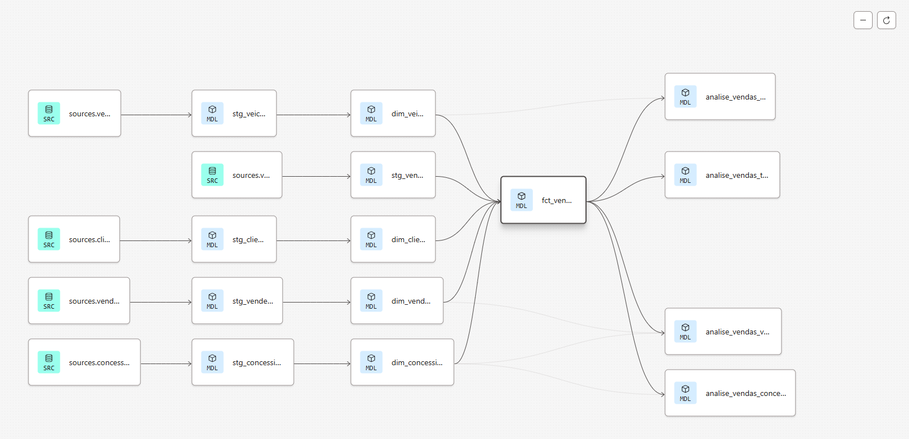

### Projeto de Pipeline de Dados
Este projeto é uma demonstração de uma pipeline de engenharia de dados completa, desde a ingestão até a visualização. O objetivo foi construir um fluxo robusto e automatizado para processar dados de vendas, utilizando tecnologias modernas e escaláveis. O projeto é parte do [Bootcamp de Engenharia de Dados](https://www.udemy.com/course/bootcamp-engenharia-de-dados/?couponCode=MT251006G5).
#### 💻 Tecnologias e Ferramentas Utilizadas
- Apache Airflow: Orquestração e agendamento da pipeline de dados.

- Amazon S3: Armazenamento temporário dos dados brutos.

- Snowflake: Data Warehouse na nuvem para armazenamento e análise dos dados.

- dbt (data build tool): Ferramenta de transformação de dados para modelagem analítica e testes.

- Google Looker Studio: Criação de dashboards e relatórios para visualização de dados.

- Python: Linguagem de programação utilizada para a lógica da pipeline.

#### 🏗️ Arquitetura da Pipeline
A pipeline segue uma arquitetura moderna de ELT (Extract, Load, Transform) e está dividida em várias etapas:
```bash
Ingestão de Dados: Uma DAG (Directed Acyclic Graph) do Airflow é responsável por extrair os dados e carregá-los em um bucket no Amazon S3 e no Snowflake.

Modelagem e Transformação: Os dados brutos no Snowflake são transformados e modelados usando o dbt. O processo envolve:

Staging: Criação de tabelas "stage" para limpar e padronizar os dados.

Camadas de Dimensão e Fato: Construção das tabelas de dimensão e fato para facilitar a análise. A estrutura do dbt demonstra o fluxo de transformação.

Testes: Implementação de testes para garantir a qualidade e a integridade dos dados.

Camada Analítica: Uma nova camada é criada no Snowflake (analise), contendo visões e tabelas agregadas prontas para consumo por ferramentas de BI.

Visualização: Os dados da camada analítica são conectados ao Google Looker Studio para a criação de um dashboard interativo.
```
#### Estrutura do dbt


### 📊 Dashboard
O dashboard criado no Looker Studio permite uma análise aprofundada dos dados de vendas, oferecendo insights sobre desempenho de vendedores, produtos e concessionárias.

[Dashboard de Vendas](https://lookerstudio.google.com/s/mVHVeh2Q_JQ)


#### 📋 Requisitos para Execução
Para rodar este projeto localmente, é necessário ter as seguintes dependências do Airflow instaladas:
```bash
apache-Airflow
apache-airflow-providers-postgres
apache-airflow-providers-snowflake
```
Lucas Ghidini Neves de Mattos, 2025
